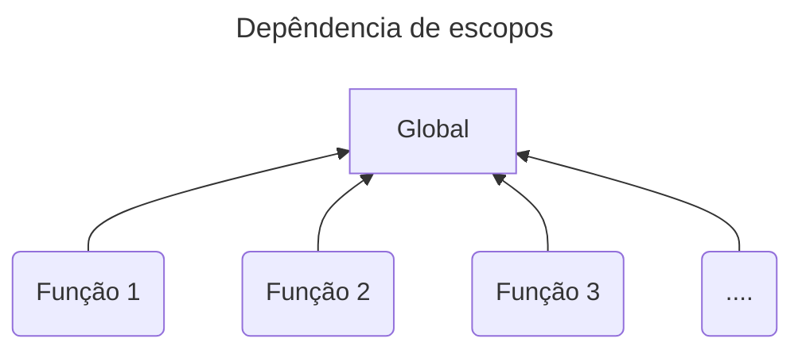

# Compilador da Linguagem C- (C menos)

## Léxico

Nessa etapa ocorre o reconhecimento de tokens. Para a realização dessa tarefa, temos dois padrões auxiliares:

- CHAR: Qualquer caractere, maiúsculo ou minúsculo entre A e Z
- DIGIT: Qualquer digito entre 0 e 9

Abaixo contém uma lista de símbolos reconhecidos pelo compilador. O nome antes da descrição do padrão de simbolos é o token atribuído quando o padrão é encontrado

- CSYMBOL: Qualquer um dos seguintes símbolos: \+ \- \* \/ \< \> \= \; \, \( \) \[ \] \{ \}
- ID: Qualquer palavra formada por um ou mais CSYMBOL
- NUM: Qualquer número formado por um ou mais DIGIT
- COMMENT: Qualquer texto escrito entre os símbolos "/\*" e "\*/"
- SYMBOL: Representa os simbolos "<=", ">=", "==", "!="

A lista restante dos tokens representam palavras chaves e são identificados pelo próprio nome:

- IF, ELSE, INT, RETURN, VOID, WHILE.

Cada token reconhecido é disparado para o analisador sintático, antes mesmo do analisador léxico começar a analisar o próximo padrão.

## Análise sintática

Nessa etapa, o programa combina tokens em sequência a fim de formar uma sentença válida. Caso a sentença não seja válida, um erro sintático é disparado e o programa é finalizado. Uma sentença pode ser descrita por uma gramática livre de contexto. No caso desse projeto, a gramática utilizada é uma variante da BNF [saiba mais](https://www.dca.fee.unicamp.br/cursos/EA876/apostila/HTML/node44.html)

Segue uma lista de regras sintáticas que definem a linguagem desse projeto:

1. programa &rarr; decl-lista
2. decl_lista &rarr; decl_lista decl | decl
3. decl &rarr; var_decl | fun_decl
4. var_decl &rarr; tipo_esp ID ; | tipo_esp ID [ NUM ] ;
5. tipo_esp &rarr; int | void
6. fun_decl &rarr; tipo_esp ID ( params ) composto_decl
7. params &rarr; param_lista | void
8. param_lista &rarr; param_lista , param | param
9. param &rarr; tipo_esp ID | tipo_esp ID [ ]
10. composto_decl &rarr; { local_decl statement_lista }
11. local_decl &rarr; local_decl var_decl | empty
12. statement_lista &rarr; statement_lista statement | empty
13. statement &rarr; exp_decl | composto_decl | selecao_decl | iteracao_decl | retorno_decl
14. exp_decl &rarr; exp ;| ;
15. selecao_decl &rarr; if ( exp ) statement else_stmt
16. else_stmt &rarr; %prec IFX | else statement
17. iteracao_decl &rarr; while ( exp ) statement
18. retorno_decl &rarr; return ; | return exp ;
19. exp &rarr; var = exp | simple_exp
20. var &rarr; ID | ID [ exp ]
21. simple_exp &rarr; soma_exp rel soma_exp | soma_exp
22. rel &rarr; <= | < | > | >= | == | !=
23. soma_exp &rarr; soma_exp soma termo | termo
24. soma &rarr; + | -
25. termo &rarr; termo mult fator | fator
26. mult &rarr; \* | /
27. fator &rarr; ( exp ) | var | act | NUM
28. act &rarr; ID ( args )
29. args &rarr; arg_lista | empty
30. arg_lista &rarr; arg_lista , exp | exp

### Regra 1

Essa é apenas a regra inicial que serve como gatilho para iniciar a análise

### Regras 4, 5, 9, 22, 24, 26

Essas regras envolvem declaração de uma variável, tipagem de dado, declaração de um único parâmetro, operadores relacionais e de soma e multiplicação. Esses casos têm garantia de sempre levarem a casos terminais. O restante têm a possibilidade de gerar loops de tamanho indefinido, permitindo que um programador crie um código de tamanho arbitrário.

### Regras 11, 8, 7

Cada uma dessas regras usam apenas um simples loop em sua composição. Elas envolvem uma sequência de declarações de variáveis tanto no início do corpo de uma função quanto como parâmetros de funções

### Outras regras

O restante das regras envolvem um ciclo vicioso de depêndencia, dificultando uma análise minuciosa. Dentre elas, a regra 19 (expressões), define uma expressão como sendo relacionada a qualquer operação matemática e relacional, ativação de função e atribuições de variáveis. Todas essas operações podem ter operandos que também são expressões.

Ainda sobre essas sentenças, temos a regra 10 (declaração composta), que define todo o corpo de uma função e pode conter declarações de variáveis, saltos condicionais, laços iterativos e expressões

## Árvore sintática abstrata (ast)

Juntamente com o processamento da análise sintática, o programa gera uma estrutura para futuras manipulações. Essa estrutura é conhecida como Árvore sintática abstrata (ou _abstract syntax tree_) e contém _keywords_ em seus nós, essas _keywords_ são descritas na lista abaixo

| Keyword     | Descrição                                          | Valor                   |
| ----------- | -------------------------------------------------- | ----------------------- |
| ALLOC       | Declaração de uma variável                         | ID -> nome da variável  |
| ALLOC_ARRAY | Declaração de um array                             | ID -> nome da variável  |
| ARRAY_SIZE  | Representa o tamanho de um array em sua declaração | NUM -> tamanho do vetor |
| INT         | Tipo especificador                                 | #                       |
| VOID        | Tipos especificador                                | #                       |
| FUN         | Declaração de função                               | ID -> nome da função    |
| ARG         | Parâmetro de uma variável primitiva                | ID -> nome da variável  |
| ARG_ARRAY   | Parâmetro de um vetor                              | ID -> nome do vetor     |
| IF          | Condicional IF                                     | #                       |
| WHILE       | Laço de repetição while                            | #                       |
| RETURN      | Declaração de retorno                              | #                       |
| ASSIGN      | Atribuição de valores                              | #                       |
| VAR         | Acesso a uma variável                              | ID -> nome da variável  |
| VAR_ARRAY   | Acesso a um vetor                                  | ID -> nome do vetor     |
| NUM         | Valor numérico literal                             | NUM -> valor literal    |
| CALL        | Ativação de função                                 | ID-> nome da função     |
| LEQ         | Relacional <=                                      | #                       |
| LESS        | Relacional <                                       | #                       |
| GEQ         | Relacional >=                                      | #                       |
| GRAND       | Relacional >                                       | #                       |
| EQ          | Relacional ==                                      | #                       |
| DIFF        | Relacional !=                                      | #                       |
| PLUS        | Operador aritmético +                              | #                       |
| MINUS       | Operador aritmético -                              | #                       |
| MULT        | Operador aritmético \*                             | #                       |
| DIV         | Operador aritmético /                              | #                       |

## Análise semântica

A árvore ast gerada anteriormente serve como entrada para a próxima etapa de análise semântica. Nessa etapa, além da verificação de erros, as `funções internas (in-built)` são registradas e também é criado a estrutura de `tabela de símbolos`, responsável por armazenar o nome, escopo e valores literais das variáveis e funções. Por simplicidade, o escopo desse projeto se limita apenas ao escopo global e escopo de funções.

Os erros semânticos analisados nesse projeto são:

1. Múltiplas declarações de uma mesma variável
2. Operação entre dados de tipos incompativeis
3. Função main não encontrada
4. Número errado de argumentos de uma função
5. Chamada de variável não declarada

Diferente das etapas anteriores, quando um erro é disparado, o código continua sendo processado. Somente após o término da análise que o processo de compilação é interrompido e notifica os erros semânticos encontrados pelo caminho.

### Tabela de símbolos
Como dito anteriormente, a tabela de símbolos é uma estrutura preenchida durante a análise semântica. Seu objetivo é gerenciar informações dos nomes e tipos de variáveis, funções e parâmetros. 

A tabela de símbolos possui os seguintes dados:
1. `scope` Nome do seu escopo
2. `size` Quantidade de filhos
3. `env` Lista de entrada dos dados (symbolEntry)
4. `child` Lista de Escopos filhos
5. `parent` Escopo pai

Enquanto isso, cada entrada na tabela de símbolos pode ser do tipo variável:
1. `name` Nome da variável
2. `type` Tipo do dado
3. `def*`Lista da linha de definição da variável
4. `ndef` Quantidade de definições ao longo do arquivo
5. `_typ`: Tipo interno (Função ou variável)

ou função:
1. `name` Nome da função
2. `type` Tipo do dado
3. `params` Lista do nome dos parâmetros
4. `paramsType` Lista dos tipos de dados do parâmetro
5. `nParams` Quantidade de parâmetros
6. `call` Lista das linhas onde a função foi chamada
7. `ncall` Quantidade de chamada da função
8. `def` Lista da linha de definição da função
9. `ndef` Quantidade de vezes que a função foi definida
10. `_type` Tipo interno (Função ou variável)